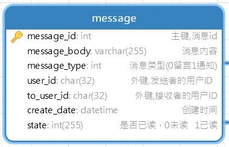

使用到的技术：  

| 技术 | 说明 |   
| :--- | :--- |  
| SpringBoot | SSM整合 |  
| Fluent-Mybatis | ORM框架 |  
| MySql | 数据库 |  
| SaToken | 权限认证框架 |

##### 聊天模块的实现
>  使用WebScoket时间聊天功能，使用mysql记录聊天记录  
>  表设计：  
>   
>   
> 步骤：
> - 1、生成对应的mapper\entity  
> - 2、Service层
> - 3、Controller层：接收并解析前端传来的json，将数据保存到数据库。在此时，为减少数据库的
频繁操作，定义一个静态的MessageList(或者使用redis)暂存聊天记录。
> - 4、所有聊天记录保存到数据库.

#### 数据库
使用MySql作为数据库
