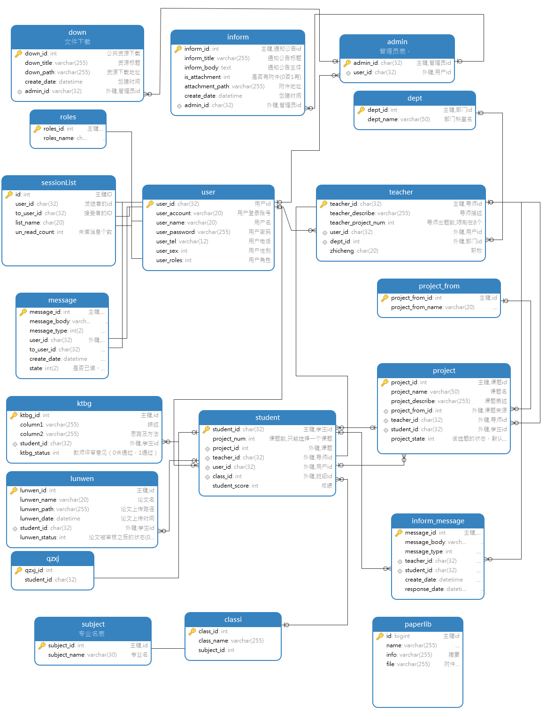

# 不再更新；未完成(有基本结构功能但不完整)；

### 使用SpringBoot+Vue实现的前后端分离的毕业论文(设计)管理系统

### 主要功能：   
系统有三种用户角色，分别为学生用户、教师用户、管理员用户。
三种用户分别有对应的页面实现不同的功能。
实现了选题、聊天、论文资料提交等功能。

### 前端

GraduationProjectManager-front为前端项目  
主要技术:

| 技术           | 功能         |
| -------------- | ------------ | 
| Vue |  |
|Ant Design|UI组件库|
|Vuex|记录状态|
|Vue-Router|路由|
|Axios|Http请求库|

### 后端

GraduationProjectManager-api为后端项目目录，使用Maven构建
主要技术:

| 技术           | 功能         |
| -------------- | ------------ |
| SpringBoot     |              |
| Fluent MyBatis | ORM持久层框架   |
| SaToken        | 权限验证框架 |
| MySql          | 数据库       |
| Swagger-UI|在线接口文档|

### 数据库设计  
数据库模型图：  

